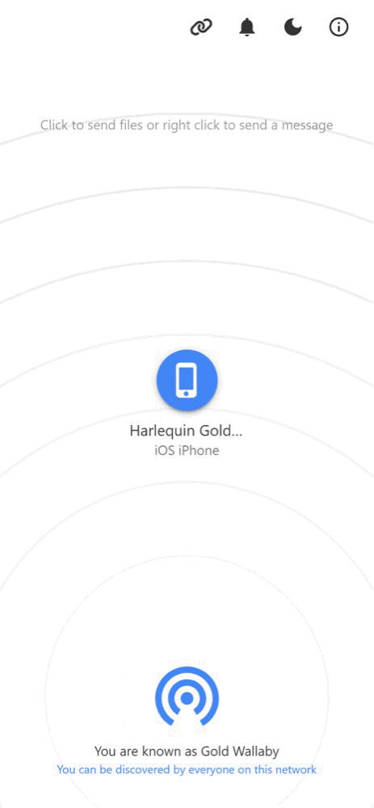

  
 
  # _Send it_, with [PairDrop](https://pairdrop.net)

  

    Local file sharing <a href="https://pairdrop.net"><strong>in your web browser</strong></a>. 
     
    Inspired by Apple's AirDrop.
      
    Fork of Snapdrop.
     
     
    <a href="https://github.com/schlagmichdoch/PairDrop/issues">Report a bug</a>
     
    <a href="https://github.com/schlagmichdoch/PairDrop/issues">Request feature</a>
  

 

## Features
File sharing on your local network that works on all platforms.

- A multi-platform AirDrop-like solution that works.
  - Send images, documents or text via peer-to-peer connection to devices on the same local network.
- Internet transfers
  - Join temporary public rooms to transfer files easily over the Internet.
- Web-app 
  - Works on all devices with a modern web-browser.
 
Send a file from your phone to your laptop?
 Share photos in original quality with friends using Android and iOS?
 Share private files peer-to-peer between Linux systems?

## Differences to the [Snapdrop](https://github.com/RobinLinus/snapdrop) it is based on

View all differences

### Paired Devices and Public Rooms — Internet Transfer
* Transfer files over the Internet between paired devices or by entering temporary public rooms.
* Connect to devices in complex network environments (public Wi-Fi, company network, iCloud Private Relay, VPN, etc.).
* Connect to devices on your mobile hotspot.
* Devices outside of your local network that are behind a NAT are auto-connected via the PairDrop TURN server.
* Devices from the local network, in the same public room, or previously paired are shown.

#### Persistent Device Pairing

Always connect to known devices

* Pair devices via a 6-digit code or a QR-Code.
* Paired devices always find each other via shared secrets independently of their local network. 
* Pairing is persistent. You find your devices even after reopening PairDrop.
* You can edit and unpair devices easily.

#### Temporary Public Rooms

Connect to others in complex network situations, or over the Internet.

* Enter a public room via a 5-letter code or a QR-code.
* Enter a public room to temporarily connect to devices outside your local network.
* All devices in the same public room see each other.
* Public rooms are temporary. Closing PairDrop  leaves all rooms.

### [Improved UI for Sending/Receiving Files](https://github.com/RobinLinus/snapdrop/issues/560)
* Files are transferred after a request is accepted. Files are auto-downloaded upon completing a transfer, if possible.
* Multiple files are downloaded as a ZIP file
* Download, share or save to gallery via the "Share" menu on Android and iOS.
* Multiple files are transferred at once with an overall progress indicator.

### Send Files or Text Directly From Share Menu, Context Menu or CLI
* [Send files directly from context menu on Ubuntu (using Nautilus)](docs/how-to.md#send-multiple-files-and-directories-directly-from-context-menu-on-ubuntu-using-nautilus)
* [Send files directly from the context menu on Windows](docs/how-to.md#send-files-directly-from-context-menu-on-windows)
* [Send directly from the "Share" menu on iOS](docs/how-to.md#send-directly-from-share-menu-on-ios)
* [Send directly from the "Share" menu on Android](docs/how-to.md#send-directly-from-share-menu-on-android)
* [Send directly via the command-line interface](docs/how-to.md#send-directly-via-command-line-interface)

### Other Changes
* Change your display name to easily differentiate your devices.
* [Paste files/text and choose the recipient afterwards ](https://github.com/RobinLinus/snapdrop/pull/534)
* [Prevent devices from sleeping on file transfer](https://github.com/RobinLinus/snapdrop/pull/413)
* Warn user before PairDrop is closed on file transfer
* Open PairDrop on multiple tabs simultaneously (Thanks [@willstott101](https://github.com/willstott101))
* [Video and audio preview](https://github.com/RobinLinus/snapdrop/pull/455) (Thanks [@victorwads](https://github.com/victorwads))
* Switch theme back to auto/system after dark or light mode is on
* Node-only implementation (Thanks [@Bellisario](https://github.com/Bellisario))
* Auto-restart on error (Thanks [@KaKi87](https://github.com/KaKi87))
* Lots of stability fixes (Thanks [@MWY001](https://github.com/MWY001) [@skiby7](https://github.com/skiby7) and [@willstott101](https://github.com/willstott101))
* To host PairDrop on your local network (e.g. on Raspberry Pi): [All peers connected with private IPs are discoverable by each other](https://github.com/RobinLinus/snapdrop/pull/558)
* When hosting PairDrop yourself, you can [set your own STUN/TURN servers](docs/host-your-own.md#specify-stunturn-servers)
* Translations.

## Translate PairDrop on [Hosted Weblate](https://hosted.weblate.org/engage/pairdrop/)

## Built with the following awesome technologies:
* Vanilla HTML5 / JS ES6 / CSS 3 frontend
* [WebRTC](http://webrtc.org/) / WebSockets
* [Node.js](https://nodejs.org/en/) backend
* [Progressive web app (PWA)](https://en.wikipedia.org/wiki/Progressive_web_app) unified functionality
* [IndexedDB API](https://developer.mozilla.org/en-US/docs/Web/API/IndexedDB_API) storage handling
* [zip.js](https://gildas-lormeau.github.io/zip.js/) library
* [cyrb53](https://github.com/bryc/code/blob/master/jshash/experimental/cyrb53.js) super-fast hash function
* [NoSleep](https://github.com/richtr/NoSleep.js) display sleep, add wake lock ([MIT](licenses/MIT-NoSleep))
* [heic2any](https://github.com/alexcorvi/heic2any) HEIC/HEIF to PNG/GIF/JPEG ([MIT](licenses/MIT-heic2any))
* [Weblate](https://weblate.org/) web-based localization tool
* [BrowserStack](https://www.browserstack.com/) This project is tested with BrowserStack

[FAQ](docs/faq.md)

[Host your own instance with Docker or Node.js](docs/host-your-own.md).

## Support

 
 

PairDrop is libre, and always will be. \
If you find it useful and want to support free and open-source software, please consider donating using the button above. \
I footed the bill for the domain and the server, and you can help create and maintain great software by supporting me. \
Thank you very much for your contribution!

## Contributing
Feel free to [open an issue](https://github.com/schlagmichdoch/pairdrop/issues/new/choose) or a
[pull request](https://github.com/schlagmichdoch/pairdrop/pulls), following the
[Contributing Guidelines](CONTRIBUTING.md).
