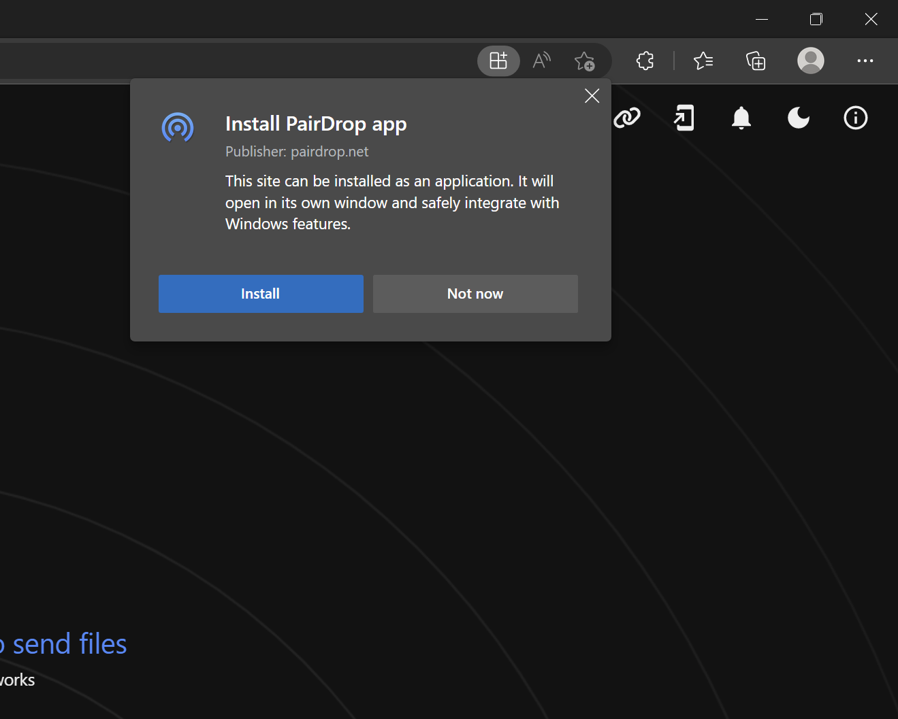

# Frequently Asked Questions

    Help! I can't install the PWA!

 

Here is a good guide on how to install PWAs on different platforms: \
https://www.cdc.gov/niosh/mining/content/hearingloss/installPWA.html

**Chromium-based browser on Desktop (Chrome, Edge, Vivaldi, Brave, etc.)** \
Easily install PairDrop PWA on your desktop by clicking the install-button in the top-right corner while on [pairdrop.net](https://pairdrop.net).

**Desktop Firefox** \
On Firefox, PWAs are installable via [this browser extensions](https://addons.mozilla.org/de/firefox/addon/pwas-for-firefox/)

**Android** \
PWAs are installable only by using Google Chrome or Samsung Browser:
1. Visit [pairdrop.net](https://pairdrop.net)
2. Click _Install_ on the installation pop-up or use the three-dot-menu and click on _Add to Home screen_
3. Click _Add_ on the pop-up

**iOS** \
PWAs are installable only by using Safari:
1. Visit [pairdrop.net](https://pairdrop.net)
2. Click on the share icon
3. Click _Add to Home Screen_
4. Click _Add_ in the top right corner

 

**Self-Hosted Instance?** \
To be able to install the PWA from a self-hosted instance, the connection needs to be [established through HTTPS](https://developer.mozilla.org/en-US/docs/Web/Progressive_web_apps/Installable_PWAs).
See [this host your own section](https://github.com/schlagmichdoch/PairDrop/blob/master/docs/host-your-own.md#testing-pwa-related-features) for more info.

 

    Shortcuts?

 

Available shortcuts:
- Send a message with `CTRL + ENTER`
- Close all "Send" and "Pair" dialogs by pressing `Esc`.
- Copy a received message to the clipboard with `CTRL/⌘ + C`.
- Accept file-transfer requests with `Enter` and decline with `Esc`.
 

    How to save images directly to the gallery on iOS?

 

~~Apparently, iOS does not allow images shared from a website to be saved to the gallery directly.~~
~~It simply does not offer that option for images shared from a website.~~

~~iOS Shortcuts saves the day:~~ \
I created a simple iOS shortcut that takes your photos and saves them to your gallery:
https://routinehub.co/shortcut/13988/

Update: \
Apparently, this was only a bug that is fixed in recent iOS version (https://github.com/WebKit/WebKit/pull/13111). \
If you use an older affected iOS version this might still be of use. \
Luckily, you can now simply use `Save Image`/`Save X Images` 🎉

 

    Is it possible to send files or text directly from the "Context" or "Share" menu?

 

Yes, it finally is.
* [Send files directly from the "Context" menu on Windows](/docs/how-to.md#send-files-directly-from-context-menu-on-windows)
* [Send directly from the "Share" menu on iOS](/docs/how-to.md#send-directly-from-share-menu-on-ios)
* [Send directly from the "Share" menu on Android](/docs/how-to.md#send-directly-from-share-menu-on-android)

 

    Is it possible to send files or text directly via CLI?

 

Yes.

* [Send directly from a command-line interface](/docs/how-to.md#send-directly-via-command-line-interface)

 

    Are there any third-party Apps?

 

These third-party apps are compatible with PairDrop:

1. [Snapdrop Android App](https://github.com/fm-sys/snapdrop-android)
2. [Snapdrop for Firefox (Addon)](https://github.com/ueen/SnapdropFirefoxAddon)
3. Feel free to make one :)

 

    What about the connection? Is it a P2P connection directly from device to device or is there any third-party-server?

 

It uses a WebRTC peer-to-peer connection.
WebRTC needs a signaling server that is only used to establish a connection.
The server is not involved in the file transfer.

If the devices are on the same network,
none of your files are ever sent to any server.

If your devices are paired and behind a NAT,
the PairDrop TURN Server is used to route your files and messages.
See the [Technical Documentation](technical-documentation.md#encryption-webrtc-stun-and-turn)
to learn more about STUN, TURN and WebRTC.

If you host your own instance
and want to support devices that do not support WebRTC,
you can [start the PairDrop instance with an activated WebSocket fallback](https://github.com/schlagmichdoch/PairDrop/blob/master/docs/host-your-own.md#websocket-fallback-for-vpn).

 

    What about privacy? Will files be saved on third-party servers?

 

Files are sent directly between peers.
PairDrop doesn't even use a database.
If curious, study [the signaling server](https://github.com/schlagmichdoch/PairDrop/blob/master/server/ws-server.js).
WebRTC encrypts the files in transit.

If the devices are on the same network,
none of your files are ever sent to any server.

If your devices are paired and behind a NAT,
the PairDrop TURN Server is used to route your files and messages.
See the [Technical Documentation](technical-documentation.md#encryption-webrtc-stun-and-turn)
to learn more about STUN, TURN and WebRTC.

 

    What about security? Are my files encrypted while sent between the computers?

 

Yes. Your files are sent using WebRTC, encrypting them in transit.
Still you have to trust the PairDrop server. To ensure the connection is secure and there is no [MITM](https://en.m.wikipedia.org/wiki/Man-in-the-middle_attack) there is a plan to make PairDrop
zero trust by encrypting the signaling and implementing a verification process. See [issue #180](https://github.com/schlagmichdoch/PairDrop/issues/180) to keep updated.

 

    Transferring many files with paired devices takes too long

 

Naturally, if traffic needs to be routed through the TURN server
because your devices are behind different NATs, transfer speed decreases.

You can open a hotspot on one of your devices to bridge the connection,
which omits the need of the TURN server.

- [How to open a hotspot on Windows](https://support.microsoft.com/en-us/windows/use-your-windows-pc-as-a-mobile-hotspot-c89b0fad-72d5-41e8-f7ea-406ad9036b85#WindowsVersion=Windows_11)
- [How to open a hotspot on macOS](https://support.apple.com/guide/mac-help/share-internet-connection-mac-network-users-mchlp1540/mac)
- [Library to open a hotspot on Linux](https://github.com/lakinduakash/linux-wifi-hotspot)

You can also use mobile hotspots on phones to do that. 
Then, all data should be sent directly between devices and not use your data plan.

 

    Why don't you implement feature xyz?

 

Snapdrop and PairDrop are a study in radical simplicity.
The user interface is insanely simple.
Features are chosen very carefully because complexity grows quadratically
since every feature potentially interferes with each other feature.
We focus very narrowly on a single use case: instant file transfer. 
Not facilitating optimal edge-cases means better flow for average users.
Don't be sad. We may decline your feature request for the sake of simplicity. 

Read *Insanely Simple: The Obsession that Drives Apple's Success*,
and/or *Thinking, Fast and Slow* to learn more.

 

    PairDrop is awesome. How can I support it? 

 

* [Buy me a coffee](https://www.buymeacoffee.com/pairdrop) to pay for the domain and the server, and support libre software.
* [File bugs, give feedback, submit suggestions](https://github.com/schlagmichdoch/pairdrop/issues)
* Share PairDrop on social media.
* Fix bugs and create a pull request.
* Do some security analysis and make suggestions.
* Participate in [active discussions](https://github.com/schlagmichdoch/PairDrop/discussions)

 

    How does it work?

 

[See here for info about the technical implementation](/docs/technical-documentation.md)

 

[< Back](/README.md)
